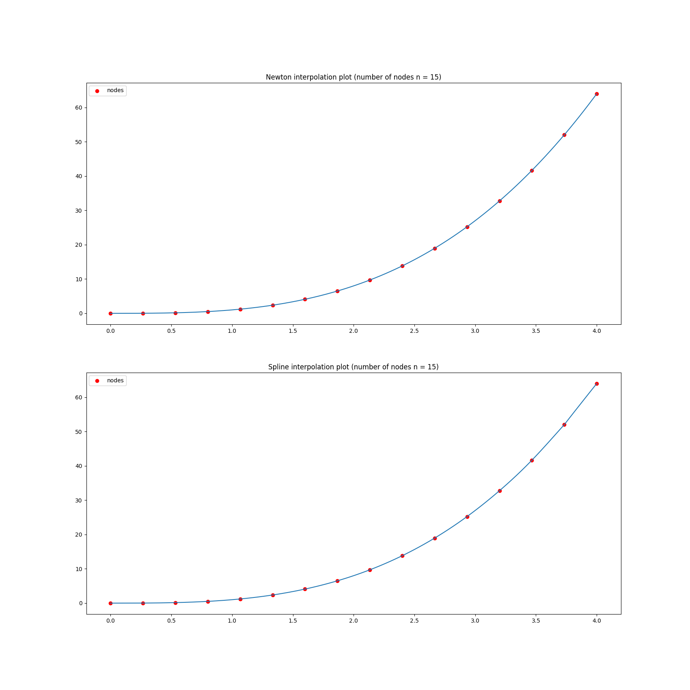
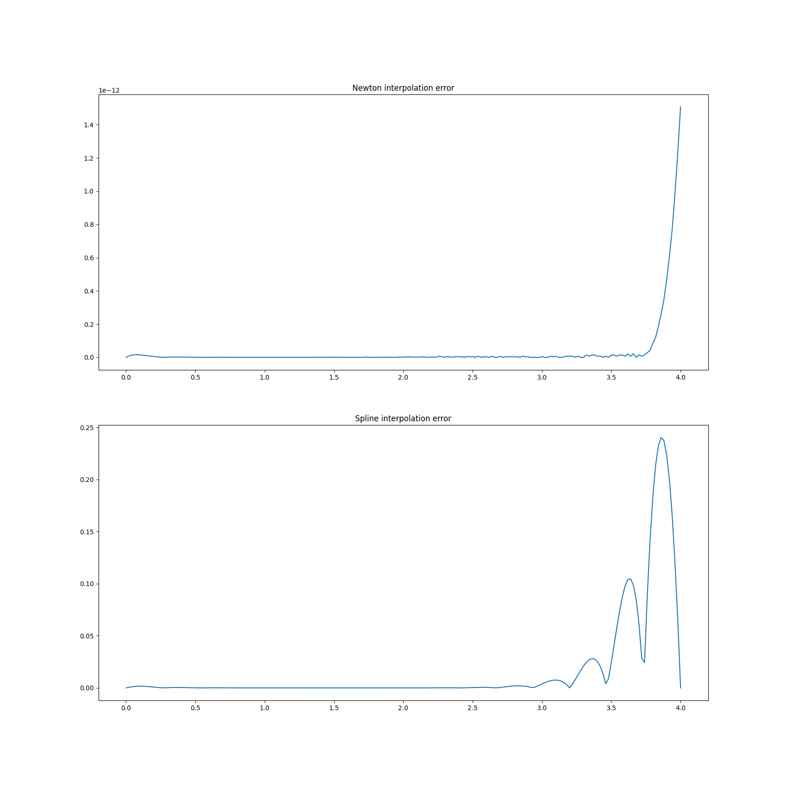

# Варіант завдання (4)

| Функція     | Відрізок    |
|-------------|-------------|
| $x\sqrt{x}$ | $[0,4]$     |

# Program output
```bash
Values at nodes table
         x    f(x)
0   0.0000   0.000
1   0.2667   0.019
2   0.5333   0.152
3   0.8000   0.512
4   1.0667   1.214
5   1.3333   2.370
6   1.6000   4.096
7   1.8667   6.504
8   2.1333   9.709
9   2.4000  13.824
10  2.6667  18.963
11  2.9333  25.240
12  3.2000  32.768
13  3.4667  41.662
14  3.7333  52.034
15  4.0000  64.000

Newton polynomial P(x) = 0.0 + 0.07111*(x - 0.0) +
0.8*(x - 0.0)(x - 0.26667) + 1.0*(x - 0.0)(x -
0.26667)(x - 0.53333) + -0.0*(x - 0.0)(x - 0.26667)
(x - 0.53333)(x - 0.8) + 0.0*(x - 0.0)(x - 0.26667)
(x - 0.53333)(x - 0.8)(x - 1.06667) + -0.0*(x - 0.0)
(x - 0.26667)(x - 0.53333)(x - 0.8)(x - 1.06667)(x -
1.33333) + 0.0*(x - 0.0)(x - 0.26667)(x - 0.53333)
(x - 0.8)(x - 1.06667)(x - 1.33333)(x - 1.6) + -0.0*
(x - 0.0)(x - 0.26667)(x - 0.53333)(x - 0.8)(x -
1.06667)(x - 1.33333)(x - 1.6)(x - 1.86667) + 0.0*
(x - 0.0)(x - 0.26667)(x - 0.53333)(x - 0.8)
(x - 1.06667)(x - 1.33333)(x - 1.6)(x - 1.86667)
(x - 2.13333) + -0.0*(x - 0.0)(x - 0.26667)(x - 0.53333)
(x - 0.8)(x - 1.06667)(x - 1.33333)(x - 1.6)
(x - 1.86667)(x - 2.13333)(x - 2.4) + 0.0*(x - 0.0)
(x - 0.26667)(x - 0.53333)(x - 0.8)(x - 1.06667)(x -
1.33333)(x - 1.6)(x - 1.86667)(x - 2.13333)(x - 2.4)
(x - 2.66667) + -0.0*(x - 0.0)(x - 0.26667)(x - 0.53333)
(x - 0.8)(x - 1.06667)(x - 1.33333)(x - 1.6)(x -
1.86667)(x - 2.13333)(x - 2.4)(x - 2.66667)(x -
2.93333) + 0.0*(x - 0.0)(x - 0.26667)(x - 0.53333)
(x - 0.8)(x - 1.06667)(x - 1.33333)(x - 1.6)(x -
1.86667)(x - 2.13333)(x - 2.4)(x - 2.66667)(x - 2.93333)
(x - 3.2) + -0.0*(x - 0.0)(x - 0.26667)(x - 0.53333)
(x - 0.8)(x - 1.06667)(x - 1.33333)(x - 1.6)(x - 1.86667)
(x - 2.13333)(x - 2.4)(x - 2.66667)(x - 2.93333)
(x - 3.2)(x - 3.46667)

Approx max error of newton interpolation: 1.5063505998114124e-12

Approx max error of spline interpolation: 0.24043202610223346
Theoretical error of spline interpolation: 0.2844444444444458
```




# Code
```python
import numpy as np
import pandas
from scipy.misc import derivative
from scipy.linalg import solve_banded
import matplotlib.pyplot as plt


def construct_nodes(interval, n):
    return [
        interval[0] + i * (interval[1] - interval[0]) / n
        for i in range(0, n+1)]


def print_polynome(coeffs, n, points):
    factors = lambda pnts: ''.join(
            [f'(x - {round(x_i, 5)})' for x_i in pnts]
        ) if len(pnts) != 0 else ''

    polynome = f"{round(coeffs[0], 5)} + " + ' + '.join(
            [
                f"{round(coeffs[i], 5)}*{factors(points[:i])}"
                for i in range(1, n)
            ]
        )
    print("Newton polynomial P(x) =", polynome, '\n')


def newton_interpolation(f, interval, n):
    nodes = construct_nodes(interval, n)
    func_vals = list(map(f, nodes))
    table = list(map(
                     lambda x: [round(x[0], 4), round(x[1], 3)],
                     zip(nodes, func_vals),
                 ))
    print("Values at nodes table")
    print(pandas.DataFrame(table, columns=['x', 'f(x)']), '\n')

    def lambda_difference(args):
        if len(args) == 1:
            return f(args[0])
        return (lambda_difference(args[:-1]) -
                lambda_difference(args[1:])) / (args[0] - args[-1])

    coeffs = [lambda_difference(nodes[:i]) for i in range(1, n+1)]

    factors = lambda x, pnts: np.prod(
            [x - x_i for x_i in pnts]
        ) if len(pnts) != 0 else 1

    polynome = lambda x: sum([coeffs[i]*factors(x, nodes[:i])
                              for i in range(0, n)])
    print_polynome(coeffs, n, nodes)
    return polynome


def c_find(h, n, func_vals):
    banded_mtrx = np.ndarray((3, n))
    banded_mtrx[1] = np.array([1.0] + [4*h for _ in range(1, n-1)] + [1.0])
    banded_mtrx[0] = np.array([0] + [h for _ in range(1, n)])
    banded_mtrx[2] = np.array([h for _ in range(1, n)] + [0])
    vec = np.array(
                   [0] + [3/h*(
                    func_vals[i] - 2*func_vals[i-1] + func_vals[i-2]
                   ) for i in range(2, n)] + [0])
    return solve_banded((1, 1), banded_mtrx, vec)


def spline_interpolation(f, interval, n):
    points = construct_nodes(interval, n)
    y = list(map(f, points))
    h = (interval[1] - interval[0]) / n
    a = y[:-1]
    c = c_find(h, n, y)
    b = [
        (y[i+1] - y[i]) / h - h/3*(c[i+1] + 2*c[i]) for i in range(0, n-1)
    ] + [(y[n] - y[n-1]) / h - 2*h/3*c[n-1]]

    d = [(c[i+1] - c[i])/(3*h) for i in range(0, n-1)] + [-c[n-1]/(3*h)]

    def interpolate(x):
        for i in range(0, n):
            if x < points[i+1] and x >= points[i]:
                return a[i] + b[i]*(x - points[i]) + \
                    c[i] * (x - points[i])**2 + d[i]*(x - points[i])**3
        if x == points[n]:
            return y[n]

    return interpolate


def find_max_abs(func, interval):
    points = construct_nodes(interval, 300)
    vals = list(map(lambda x: np.abs(func(x)), points))
    return max(vals)


def main():
    # input data
    f = lambda x: x * np.square(x)
    interval = [0, 4]
    n = 15

    # interpolation
    P = newton_interpolation(f, interval, n)
    epsilonP = lambda x: np.absolute(f(x) - P(x))

    print("Approx max error of newton interpolation:",
          find_max_abs(epsilonP, interval), '\n')

    S = spline_interpolation(f, interval, n)
    epsilonS = lambda x: np.absolute(f(x) - S(x))

    print("Approx max error of spline interpolation:",
          find_max_abs(epsilonS, interval))

    theoretical_eps = 5/2 * ((interval[1] - interval[0]) / n) ** 3 \
        * find_max_abs(
            lambda x: derivative(f, x, n=3, order=5), interval,
        )
    print("Theoretical error of spline interpolation:",
          theoretical_eps, '\n')

    # visualization
    plt_points = construct_nodes(interval, 200)
    plt_nodes = construct_nodes(interval, n)

    plt_P = list(map(P, plt_points))
    plt_S = list(map(S, plt_points))
    fig, ax = plt.subplots(2, 1, figsize=(17, 17))

    ax[0].plot(plt_points, plt_P)
    ax[0].scatter(plt_nodes, list(map(P, plt_nodes)),
                  color='red', label="nodes")
    ax[0].set_title("Newton interpolation plot (number of nodes n = 15)")
    ax[0].legend()

    ax[1].plot(plt_points, plt_S)
    ax[1].scatter(plt_nodes, list(map(S, plt_nodes)),
                  color='red', label="nodes")
    ax[1].set_title("Spline interpolation plot (number of nodes n = 15)")
    ax[1].legend()

    fig.savefig('interpolation.png')

    plt_Nerrs = list(map(epsilonP, plt_points))
    plt_Serrs = list(map(epsilonS, plt_points))
    fig, ax = plt.subplots(2, 1, figsize=(17, 17))

    ax[0].plot(plt_points, plt_Nerrs)
    ax[0].set_title("Newton interpolation error")

    ax[1].plot(plt_points, plt_Serrs)
    ax[1].set_title("Spline interpolation error")

    fig.savefig('error.png')


if __name__ == "__main__":
    main()
```
