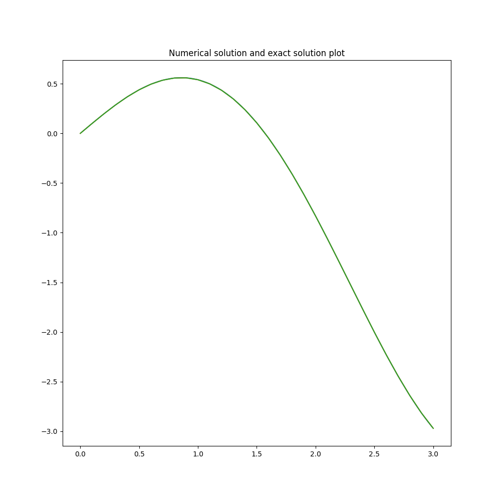
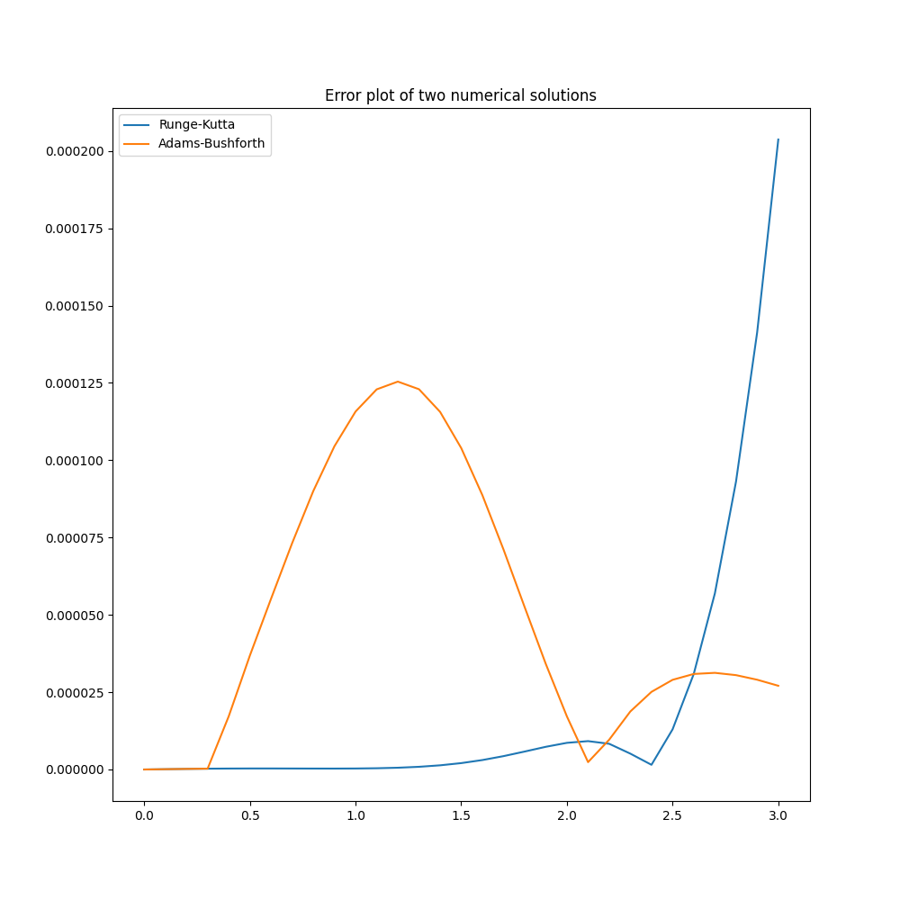

# Варіант завдання (4)

Рівняння $\displaystyle y' = \left(1-x^2\right) y + F(x)$

$h = 0.1$

Точний розв'язок $y = x \cos x$

Визначаємо $F(x)$:
\begin{align*}
\cos x - x \sin x &= \left( 1 - x^2 \right) x \cos x + F(x) \\
F(x) &= \left( x^3 - x + 1 \right) \cos x - x \sin x
\end{align*}

Умови:
\begin{equation}
\begin{cases}
\displaystyle \frac{\partial y}{\partial x} = (1 - x^2) y + (x^3 - x + 1) \cos x - x \sin x \\
y(0) = 0
\end{cases}
\end{equation}


# Program output
```bash
Function values
      x      f(x)  Runge-Kutta  Adams-Bushforth
0   0.0  0.000000     0.000000         0.000000
1   0.1  0.099500     0.099500         0.099500
2   0.2  0.196013     0.196013         0.196013
3   0.3  0.286601     0.286601         0.286601
4   0.4  0.368424     0.368424         0.368407
5   0.5  0.438791     0.438791         0.438754
6   0.6  0.495201     0.495201         0.495146
7   0.7  0.535390     0.535389         0.535316
8   0.8  0.557365     0.557365         0.557275
9   0.9  0.559449     0.559449         0.559344
10  1.0  0.540302     0.540302         0.540187
11  1.1  0.498956     0.498955         0.498833
12  1.2  0.434829     0.434829         0.434704
13  1.3  0.347748     0.347748         0.347626
14  1.4  0.237954     0.237953         0.237838
15  1.5  0.106106     0.106104         0.106002
16  1.6 -0.046719    -0.046722        -0.046808
17  1.7 -0.219036    -0.219040        -0.219107
18  1.8 -0.408964    -0.408970        -0.409016
19  1.9 -0.614250    -0.614258        -0.614284
20  2.0 -0.832294    -0.832302        -0.832311
21  2.1 -1.060177    -1.060186        -1.060179
22  2.2 -1.294702    -1.294711        -1.294693
23  2.3 -1.532435    -1.532440        -1.532416
24  2.4 -1.769745    -1.769743        -1.769720
25  2.5 -2.002859    -2.002846        -2.002830
26  2.6 -2.227911    -2.227880        -2.227880
27  2.7 -2.440995    -2.440938        -2.440964
28  2.8 -2.638223    -2.638129        -2.638192
29  2.9 -2.815779    -2.815637        -2.815750
```





# Code
```python
import numpy as np
import pandas
import matplotlib.pyplot as plt


def solve_runge_kutta(f, x, y, h, n):
    y_arr = [y]
    x_arr = [x]
    for _ in range(0, n):
        k_1 = h*f(x, y)
        k_2 = h*f(x + 1/2*h, y + 1/2*k_1)
        k_3 = h*f(x + 1/2*h, y + 1/2*k_2)
        k_4 = h*f(x+h, y + k_3)
        y = y + 1/6*(k_1 + 2*k_2 + 2*k_3 + k_4)
        x = x + h
        y_arr.append(y)
        x_arr.append(x)
    return x_arr, y_arr


def solve_adams_bushforth(f, x_0, y_0, h, n):
    x, y = solve_runge_kutta(f, x_0, y_0, h, 3)
    for i in range(3, n):
        y.append(
            y[i] + h*(55*f(x[i], y[i]) - 59*f(x[i-1], y[i-1]) +
                37*f(x[i-2], y[i-2]) - 9*f(x[i-3], y[i-3]))/24
        )
        x.append(x[i] + h)
    return x, y


def main():
    def f(x, y):
        return (1 - x**2) * y + (x**3 - x + 1)*np.cos(x) - x * np.sin(x)
    h = 0.1
    n = 30
    exact = lambda x: x * np.cos(x)

    x, y1 = solve_runge_kutta(f, 0, 0, h, n)
    x, y2 = solve_adams_bushforth(f, 0, 0, h, n)
    f_x = list(map(exact, x))

    print("Function values")
    table = [
        [x[i], f_x[i], y1[i], y2[i]] for i in range(0, n)]
    print(pandas.DataFrame(table, columns=['x', 'f(x)', 'Runge-Kutta',
                           'Adams-Bushforth']), '\n')

    err1 = [np.absolute(y1[i] - f_x[i]) for i in range(0, n+1)]
    err2 = [np.absolute(y2[i] - f_x[i]) for i in range(0, n+1)]

    fig, ax = plt.subplots(figsize=(12, 12))
    xx = [0.01 * k for k in range(1, 10*n)]
    ax.plot(xx, list(map(exact, xx)))
    ax.plot(x, y1)
    ax.plot(x, y2)
    ax.set_title("Numerical solution and exact solution plot")
    fig.savefig('solution.png')

    fig, ax = plt.subplots(figsize=(12, 12))
    ax.plot(x, err1, label="Runge-Kutta")
    ax.plot(x, err2, label="Adams-Bushforth")
    ax.set_title("Error plot of two numerical solutions")
    ax.legend()
    fig.savefig('errors.png')


if __name__ == "__main__":
    main()
```
